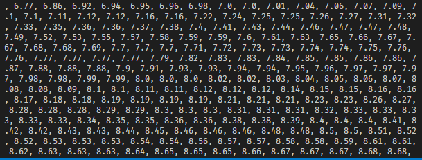

# 프로젝트 진행상황(Readme) - backend

복습: No
작성일시: 2022년 11월 16일 오전 11:26

1. dataset json 만들기 → 어떤식으로 구성할지 생각해보았다.
- 목적에 맞는 데이터를 뽑아오기 위해선, 대중적으로 성공한 영화들이 필요함. (적어도 이름을 한 번쯤 들어본 영화들)
- 한국영화 박스오피스 500위까지 [https://www.kobis.or.kr/kobis/business/stat/offc/findFormerBoxOfficeList.do](https://www.kobis.or.kr/kobis/business/stat/offc/findFormerBoxOfficeList.do) = 상업적으로 성공한 영화
- 의문: 그렇게 성공한 영화들은 평점이 대체로 높아서, 평점게임을 하기 부적합하지 않을까?
- 꼭 성공했다고 작품성이 높은 것이 아니라는 것을 방증하듯 평점이 다양하게 분포되어 있음. → 데이터셋 선정이 앱의 목적에 부합함을 확인.
  
    
    
- 엑셀파일 가져와서 json으로 변환(title만)
- 타이틀만 있고, 이제 게임에 필요한 데이터들을 불러와야 한다. 포스터, 평점, 그리고 결과창에서 영화 추천에 출력할 인기도까지.
- 해당 영화들로 네이버 평점 데이터를 긁어와야함: naver 검색 api 사용,
- POSTMAN 사용하여 테스트 해보며 진행.
- 추후, 데이터 시각화 툴(matplotlib)(을 활용해 평점이 다양하게 분포되었던 것을 확인하였다.

원하는 데이터 구조(대충 표현해봄)

popularity는 tmdb에서 종합적인 요소를 판단해서 선정하는데, 대중성, 평가 등이 종합적으로 반영되어 있는 수치이다.


- title에 저장된 데이터로 query를 보내, 네이버 영화 평점을 받아옴.
- title과 완벽 일치한다면, 해당 데이터를 가져온다.
- 11/16 추가: ‘완벽 일치’ 의 경우 띄어쓰기가 다르면 다르다고 판정해 버려 데이터가 들어가지 않게 된다. 이를 해결하기 위해 `replace` 를 사용해주었다.
- 문제되었던 것: 너무 빠르게 쿼리를 보내면 네이버에서 비정상적인 요청으로 인식해 응답을 주지 않음 → time 모듈의 sleep() 함수 사용하여 for문 돌아가는 속도를 의도적으로 늦춰줌으로써 해결함.
- 2012같은 경우, int 형태이기 때문에 질의를 할 때 문제가 생김 , str() 함수 사용 필요함.
- 문제되었던 게 2가지였다:
    - 원하는 영화가 아닌 다른 영화 데이터가 json에 들어감. (동명의 영화일 경우, 특히 영화이름이 흔할경우(ex, 스파이, 암살) → 연도라는 다른 식별자를 넣어 해결가능
    - 영화 데이터 자체가 안 들어감. → 이건 원인이 뭔지 모르겠다.  (ex. 에나벨)
    - 기본 페이지 구성 후 해결 예정
1. 네이버 영화에서 제공하는 것이 화질이 너무 조악하기 때문에, 이미지는 tmdb에서 가져와야 하는데 이게 될까?

→ 된다.

독립된 기능을 하는 py 파일들 추후에 하나로 통합하기.→11/17 했다.

1. 해당 dataset으로 UP-DOWN Game을 만들기 위한 Random 데이터 추출 및 index 페이지에 렌더링 작업 → 

model에 해당 json 데이터를 load하는 과정이 선행되어야 한다.

참고자료: [https://velog.io/@qlgks1/Django-Model-필드filed-모음집](https://velog.io/@qlgks1/Django-Model-%ED%95%84%EB%93%9Cfiled-%EB%AA%A8%EC%9D%8C%EC%A7%91)

[https://stackoverflow.com/questions/1884827/django-loaddata-error](https://stackoverflow.com/questions/1884827/django-loaddata-error)


해당 에러가 떴던 이유는 목표 영화를 불러오기 전에 정보가 부족한 독립영화를 먼저 불러왔고, 해당 독립영화에 release_date 항목이 비어있어서 int()를 사용하는 과정에서 오류가 생긴 것이었다.

이를 해결하기 위해 try: except 구문을 만들어주었다. 이로써 해당 오류가 나도 스킵하고 다음 영화에 대해 title이 일치하는지 비교할 수 있게 되었다.

1. json으로 된 data set을 model에 loaddata 할 수 있도록 적절하게 형태를 변환해주는 코드이다.

prototype.json을 가져와 model, pk 정보를 넣어줘 load하기 적합한 형식으로 만들어준다.

```jsx
import json

file_path = './prototype.json'
with open(file_path,'r', encoding='UTF-8') as file:
    datas = json.load(file)

    print(len(datas))
    dataset = []

    for i in range(len(datas)):
        dataset.append({
            'model' : 'myimport.movies',
            'pk' : i+1,
            'fields': datas[i]
        }) #해당 부분은 프로젝트 이름에 맞춰 수정
#print(dataset[1])

file_path = './datasets.json'
with open(file_path,'w', encoding='UTF-8') as outfile:
    json.dump(dataset, outfile, indent = 4,ensure_ascii=False)
```

본격적인 API를 통한 데이터 받아오기

title, year이라는 두 가지 정보를 가지고 tmdb와 네이버 영화에서 필요한 데이터를 API 요청을 통해 가져와야 한다.

```python
import json
import requests 
from time import sleep

file_path = './myexcel.json'
with open(file_path,'r', encoding='UTF-8') as file:
    datas = json.load(file)

headerDict = {
    'X-Naver-Client-Id': 'A8fMBXU5thGRFAwf5QmM',
    'X-Naver-Client-Secret': 'quSkdkzvXh'
    } #네이버 검색 API에 쿼리를 보낼 때 필요한 Header

API_KEY = '469f9baab6501e0158c6f6d5bef8d9d2' #TMDB에 요청을 보내기 위한 API KEY
myjsonlist=[]
myunluckyjsonlist=[]

for i in range(len(datas)):      
    sleep(0.1) #네이버 API에서 짧은 시간 내에 요청하면 데이터를 반환 안해줌, 이를 해결하기 위함
    title = datas[i]['title']
    year = datas[i]['year']
    print(datas[i])
    #print(f'https://openapi.naver.com/v1/search/movie.json?query={title}')
    res = requests.get(f'https://openapi.naver.com/v1/search/movie.json?query={title}&display=100',headers=headerDict)
    myjson = res.json()['items'] #원하는 json 응답이 여기 들어있음.
    for j in range(len(myjson)):
        try:
            if myjson[j]['title'].replace(" ","")=='<b>'+str(title).replace(" ","")+'</b>' and (-1<=int(myjson[j]['pubDate'])-year<=1): #정확히 일치하는 것만 반환
                if myjson[j]['userRating']!="0.00":
                    # 필요한 것: link(네이버 댓글 크롤링 위함), userRating
                    datas[i]['userRating'] = myjson[j]['userRating']
                    datas[i]['link'] = myjson[j]['link']
        except:
            pass
    mytmdb = requests.get(f'https://api.themoviedb.org/3/search/movie?api_key={API_KEY}&language=ko-KR&include_adult=true&query={title}').json()['results']
    #print(mytmdb)
    for j in range(len(mytmdb)):
        try:
            if str(mytmdb[j]['title']).replace(" ","")==str(title).replace(" ","") and int(mytmdb[j]['release_date'][0:4])==year:
                datas[i]['poster_path'] = 'https://image.tmdb.org/t/p/original/'+mytmdb[j]['poster_path']
                datas[i]['popularity']  = mytmdb[j]['popularity']
                break
        except:
            pass
    
    if len(datas[i])==6:
        myjsonlist.append(datas[i])
    else:
        myunluckyjsonlist.append(datas[i])

    file_path = './prototype.json'
    with open(file_path,'w', encoding='utf-8') as outfile:
        json.dump(myjsonlist, outfile, indent = 4,ensure_ascii=False)
    
    file_path = './unluckyjson.json'
    with open(file_path,'w', encoding='utf-8') as outfile:
        json.dump(myunluckyjsonlist, outfile, indent = 4,ensure_ascii=False)
```

원하는 key를 모두 긁어온 것은 prototype.json에 넣고

만약 누락된것이 있으면 unluckyjson.json에 넣어 추후 데이터 정제 작업을 거쳐야 한다.

1. 네이버 영화 리뷰 데이터 가져오기(beautifulsoup 사용)

11/17

해당 느낌으로 데이터를 만들었는데


`link` 에서 필요한 것은 뒤에 있는 저 `code` 부분이지 링크 전체가 아니다.

크롤링을 할 때, `https://movie.naver.com/movie/bi/mi/pointWriteFormList.naver?code=`

`{이 곳에 code가 들어감}`

`&type=after&isActualPointWriteExecute=false&isMileageSubscriptionAlready=false&isMileageSubscripti[onReject=false](https://movie.naver.com/movie/bi/mi/pointWriteFormList.naver?code=94775&type=after&isActualPointWriteExecute=false&isMileageSubscriptionAlready=false&isMileageSubscriptionReject=false)`  (파이썬은 f-string 사용)

해당 링크에 들어가 댓글과 평점을 크롤링하게 되는데

그렇다면 링크를 저렇게 길게 저장할 필요가 없고, 네이버 영화에서의 pk에 해당하는 code만 저장해놨다가 결과창에서 해당 code를 집어넣은 url의 댓글만 크롤링하여 페이지에 렌더링하면 된다. 따라서 데이터셋을 수정할 것이다.

link: CharField > IntegerField, 기존의 모든 네이버 영화 링크를 넣는 것에서 맨 뒤 code만 넣도록 수정 

→ 이후 네이버 영화 리뷰에서 수정된 데이터를 가져와 줌

동명의 독립영화 필터링 → 어떻게 할지 고민해봤는데, 해당 독립영화는 리뷰데이터가 거의 없다. (국내개봉 안 했으면 시스템적으로 리뷰를 작성할 수 없다) 그 점을 이용해 크롤링과 결합하여 문제해결

→ 리뷰리스트를 크롤링하여, 리뷰가 없으면 따로 목록출력(리뷰가 없다=동명의 마이너한 영화임, 앞서 연도로 1차 필터링을 했으나 이 영화들은 연도마저 겹쳤다.)

`'괴물', '트랜스포머: 패자의 역습', '터널', '레미제라블', '타워', '귀향', '감기', '솔트', '원티드', '화차', '하녀', '박쥐', '노아'`

해당 데이터를 프로그램을 사용해 수정할 방법을 찾아봤으나 방법이 마땅치 않아 수동으로 수정할 예정

리뷰 크롤링은 Beautifulsoup 패키지를 통해 진행하였다.  해당 패키지는 아래처럼 html 페이지의 html ㅍ태그를 통해 접근하여 크롤링하는 것이 가능하다.

```python
from bs4 import BeautifulSoup
from .models import movie

for i in range(3):
        movie = random.sample(moviedatas,1)[0]
        url = f'https://movie.naver.com/movie/bi/mi/pointWriteFormList.naver?code={movie.link}&type=after&isActualPointWriteExecute=false&isMileageSubscriptionAlready=false&isMileageSubscriptionReject=false'
        html = requests.get(url)
        soup = BeautifulSoup(html.content,'html.parser')
        reviews = soup.select("div.score_reple > p > span")
        mylist = [] 
        for i in reviews:
            if i.text.strip()!='관람객':
                mylist.append(i.text.strip())
        movielist.append({
            'movie' : movie,
            'review' : mylist[0]
        })
    # print(movielist)
        
    context = {
        'movielist' : movielist,
        'stage': stage,
        'form':form,
    }
    return render(request, 'myapp/gameclear.html', context)
```


리뷰 크롤링 시, 특정 태그를 기준으로 크롤링하는데 리뷰와 같은 층위의 태그에 관람객 인증한 사람들에게 입력되는 “관람객” 이라는 텍스트가 같이 크롤링된다. 이를 해결 → 관람객 인증 댓글일 경우 댓글 앞에 ‘관람객’ 이 달리는데 이 문제를 해결하기 위해 방법을 생각해 보았다. 결론은 의외로 간단했는데 ‘관람객’ 과 문자열이 일치할 경우 댓글 리스트에 추가하지 않으면 된다. (리뷰 크롤링에서 리뷰 이외에 긁어올만한 텍스트가 그것밖에 없으므로)

- 난이도별로 영화 제시

→ filter 함수 사용

```python
 if int(selected[0]) == 1:
        for i in range(30): # 1단계, 1.5점차 이상의 영화들 출력
            currating = current_movie.userRating
            templist = list(filter(lambda x: abs(currating-x.userRating) > 1.5 and currating-x.userRating!=0, moviedata))
            current_movie = random.sample(templist,1)[0]
            randomdata.append(current_movie)
            moviedata.remove(current_movie)

    elif int(selected[0]) == 2:
        for i in range(30): # 2단계, 0.7~1.5점차의 영화들 출력
            currating = current_movie.userRating
            templist = list(filter(lambda x: 0.7<= abs(currating-x.userRating) < 1.5 and currating-x.userRating!=0, moviedata))
            current_movie = random.sample(templist,1)[0]
            randomdata.append(current_movie)
            moviedata.remove(current_movie)
            print(len(moviedata))

    else:
        for i in range(30): # 3단계, 1점차 미만의 영화들 출력
            currating = current_movie.userRating
            templist = list(filter(lambda x: abs(currating-x.userRating) <= 0.6 and currating-x.userRating!=0, moviedata))
            current_movie = random.sample(templist,1)[0]
            randomdata.append(current_movie)
            moviedata.remove(current_movie)
```

이런 식으로 난이도별로 영화를 출력하였다.

알고리즘 때 배웠던 함수들을 적극적으로 응용하였다.


[https://dreamdeveloper403.tistory.com/85](https://dreamdeveloper403.tistory.com/85)

>> 데이터셋 정제와 view함수 작성

→ 7. django에서 html로 보내준 데이터를 javascript에서 다루기

너무 난해해서, 그냥 html에 for문을 써 준 뒤 div태그 안에 원하는 값을 집어넣고 display:none 스타일 적용

이후 queryselector를 통해 값을 찾아서 사용.

```jsx
const mypercent = (mydata[index].innerText)*100/30
    innercolor[index].style.width = `${mypercent}%`
    console.log(innercolor.style)
    innercolor[index].innerText = mydata[index].innerText
```

이와 같은 코드를 통해 width를 설정해줌으로써 해결하였다.

자바스크립트로 CSS 조작은 아래를 참고해주었다.

[https://tagilog.tistory.com/555](https://tagilog.tistory.com/555)

(해결)

→ 8. 파라미터를 입력해 특정 점수의 결과창에 접근할 수 있는 문제


Get 방식으로 Gameover 창을 받아오는 것이기 때문에, URL 수정으로 원하는 점수를 얻은 결과창에 접근할 수 있다.

해결법: view함수에 데코레이터를 적용해 POST 요청으로만 접근할 수 있도록 한다. 

이제 점수를 임의로 입력해 페이지를 이동하려고 하면 (=GET 방식) 405 에러(메소드 허용되지 않음)를 반환한다.

→ 9. 404(없는 페이지), 405(require_POST 데코레이터가 달린 페이지를 GET으로 들어가려 할 경우), 500(기타 네트워크 에러) 가 발생할때 출력할 오류 설정

1. DEBUG = False 설정
2. 이렇게 하면 스태틱이 깨지는 문제가 발생한다.
3. whitenoise를 설치하려 해결해보려 했는데 생각보다 어려워서 일단 보류하였다.

최종 제출기한이 다가와 결국 포기하였다. Vue에선 404, 405페이지를 매우 쉽게 만들 수 있는데, 장고에서 해당 페이지 만들기 및 배포는 생각보다 어려웠다.. 

10. 마지막으로 스코어보드를 만들었다.

```python
def scoreboard(request):
    #높은 점수 순으로 정렬
    scoreboard = sorted(list(Scoreboard.objects.all()), key=lambda person:(person.score),reverse=True)
    
    context = {
        'scoreboard': scoreboard
    }

    return render(request,'myapp/scoreboard.html',context)
    #스코어보드에 데이터 전송
```

 스코어보드 모델을 정의하고,  모델을 불러온 뒤 score이라는 키를 기준으로 정렬해 보내주면 점수판을 만들 수 있다. 스코어보드는 Read 기능만 있는 것으로써, gameover과 gameclear 페이지에 form으로 POST 요청을 보내면 해당 페이지에서 scoreboard 모델에 데이터를 추가해주는 방식이다.