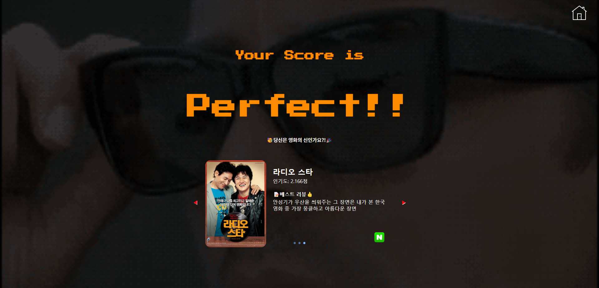

# UP & DOWN

- 기존에 존재하는 사이트 '더 많이 더 적게'를 모티브로 한 게임이 중심이 되는 사이트

- 난이도에 따라 두 개의 영화가 주어지고 하나의 영화가 다른 하나보다 평점이 낮은지 높은지를 맞추는 게임

- 사용자는 로그인, 가입을 할 필요없이 난이도를 선택해 게임을 플레이
- 최고 난이도를 플레이 한 유저의 점수를 기록할 스코어 보드가 존재


## 아이디어 발단

관통 프로젝트를 진행함에 있어 대주제 '영화'가 주어졌다. 

대주제만 지키면 된다고 했기에 무언가 개발을 하면서 스스로 나름 즐기면서 할 수 있는 것이 없을까 생각했다.

'더 많이 더 적게'라는 웹게임이 있다. 두 개의 주제가 주어지고 두 검색어 중 어떤것이 구글에서 더 많이 검색되었는지를 맞추는 심플한 게임이다. 이를 모티브로 삼아 두 영화의 평점을 비교하는 게임을 만들고자 했다.


## 담당부분

### 이상화: 

1. Scoreboard.html를 제외한 Front-end 전반 (Scoreboard는 팀원 김승준의 담당, 본인은 검수 및 수정만 담당)

### 김승준:

1. DB에 넣어야할 json파일 제작을 위한 API 데이터 요청 및 fixture 제작 Back-end 전반
2. Scoreboard.html 제작


## FE

이 프로젝트의 FE의 전반은 담당했다. 자세히는 django templates 폴더 안에 있는 scoreboard를 제외한 모든 template을 담당하게 되었다.


### game.html

가장 먼저 개발을 시작하고 가장 오랜 시간이 걸린 부분이다. 원했던 대로 게임이 정상 작동하기 위해서는 가장 중요하고 필요한 부분이라고 생각했기 때문이다.

개발을 하면서 가장 중요시 여긴 것은 사용자가 문제를 풀고 다음 문제를 받을 때 어떤 공백이나 문제가 틈이 생겨서는 안된다는 점이다.

**설명**

간단하게 전체적인 구동 과정을 보면 사용자가 처음엔 화면 왼쪽에 주어진 영화를 기준으로 화면 오른쪽에 나온 영화를 보고 평점을 유추해 높을거 같으면 up을 낮을거 같으면 down을 클릭한다. 만약 정답이 맞다면 화면이 왼쪽으로 슬라이드 되면 새로운 영화가 다음 문제로 주어진다. 반대로 틀리게 되면 점수 페이지로 넘어가게 된다.

사용자에게는 난이도 당 30문제씩 주어지며 총 3단계가 존재한다.

**결과 화면**


**코드**

```django

   <button onclick="location.href=''">clear</button>
  <br> 
   <button onclick="location.href=''">clear</button>
  <button onclick="location.href=''"> Gameover </button> 
  <div class="slide slide_wrap">
  
  
  <div class="slide_item item">
    <h1 class="movie-title">{{ movie.title }}</h1>
    <div class="result-score">
      <h2 class="count">{{ movie.userRating }} 점</h2>
      <div class="star-ratings">
        <div id="first-score" class="star-ratings-fill">
          <span>★</span><span>★</span><span>★</span><span>★</span><span>★</span>
        </div>
        <div class="star-ratings-base">
          <span>★</span><span>★</span><span>★</span><span>★</span><span>★</span>
        </div>
      </div>
    </div>
  </div>
  
  <div class="slide_item item">
    <h1 class="movie-title">{{ movie.title }}</h1>
    <div class="hidden result-score">
      <h2 class="count">0</h2>
      <div class="star-ratings">
        <div class="star-ratings-fill">
          <span>★</span><span>★</span><span>★</span><span>★</span><span>★</span>
        </div>
        <div class="star-ratings-base">
          <span>★</span><span>★</span><span>★</span><span>★</span><span>★</span>
        </div>
      </div>
    </div>
    <form id="answer-form" method="POST" action="">
      
      <button class="up_btn answer-btn">up▲</button>
      <button class="down_btn answer-btn">down▼</button>
    </form>
    <form id="full-score-form" class="hidden" action=""  method="POST">
      
    </form>
  </div>
  
  
  <div class="best-score score">
    <h3>최고 점수</h3>
    <h2 id="best-score">0</h2>
  </div>
  <div class="now-score score">
    <h3>현재 점수</h3>
    <h2 id="now-score">0</h2>
  </div>
  <div class="now-stage score">
    <h1>{{ stage }} 단계</h1>
  </div>  
  </div>
  <div id="coin" class="versus-circle">
    <div class="side vs-front">
      <h1 class="versus-word">VS</h1>
    </div>
    <div class="side vs-back"></div>
  </div>
  <div class="loading">
    
  </div>

```

- game django templates에서 html에 해당하는 부분이다. 
- 처음에 주어지는 영화에는 처음부터 평점이 주어져야 하기 때문에 첫 영화와 그 외에 영화는 조건문으로 분리해야 했다.
- 다만 화면의 구조는 동일하기 때문에 반복문을 통해 최대한 코드를 간결하게 정리하고자 했다.
- 만점시 주어지는 페이지와 오답시 주어지는 페이지는 서로 다른 템플릿을 사용하고 있기 때문에 두 개의 form이 사용되었다.
- 화면 좌측 상단에는 사용자의 기기에서 해당 난이도의 최고 점수가 나타나며, 우측 상단엔 현재 점수를 나타내고, 중앙 상단엔 현재 난이도를 나타낸다.
- 처음 화면을 불러올 때 이미지를 로딩하는 시간에 따라 화면에 최대 3초 정도까지 화면에 영화 포스터의 이미지가 나타나지 않고 공백으로 나타나는 경우가 있었기 때문에 그런 경우를 대비해 로딩화면이 나타나도록 했

```javascript
// 슬라이크 전체 크기(width 구하기)
  const slide = document.querySelector(".slide");
  let slideWidth = (slide.clientWidth)/2;
  
slideItems = document.querySelectorAll(".slide_item");
  //슬라이드를 이동시키기 위한 거리
  let offset = slideWidth + currSlide;

  function nextMove() {
    currSlide++;
    // 마지막 슬라이드 이상으로 넘어가지 않게 하기 위해서
    if (currSlide <= maxSlide) {
      // 슬라이드를 이동시키기 위한 offset 계산
      const offset = slideWidth * currSlide;
      // 각 슬라이드 아이템의 left에 offset 적용
      slideItems.forEach((i) => {
        i.style.setProperty('left', `${-offset}px`)
        // i.setAttribute("style", `left: ${-offset}px`);
      });
      //putBackgroundImg()
    } 
  }
  // 브라우저 화면이 조정될 때 마다 slideWidth를 변경하기 위해
  window.addEventListener("resize", () => {
    slideWidth = (slide.clientWidth)/2;
    const offset = slideWidth * currSlide;
    slideItems.forEach((i) => {
      i.setAttribute("style", `left: ${-offset}px`);
    });
    putBackgroundImg();
  });

```

- 해당 구문은 game.html에서 사용자가 정답을 맞출 경우 다음 문제가 슬라이드 처럼 미끄러지듯 나타나게 하기 위한 javascript코드이다.
- 사용자가 정답을 맞출 경우해당 함수가 호출 되며 한줄로 길게 펼쳐져 있던 구성요소들의 위치가 이동하며 슬라이드와 같은 애니메이션 효과가 된다.

```javascript
function vsFlip() {
    vsCircle.animate([
      {transform:"rotateY(0deg)"},
      {transform:"rotateY(180deg)"},
      {transform:"rotateY(360deg)"},
    ], {
      duration:2000,
      easing: "cubic-bezier(0.315, 1.060, 0.635, 0.015)"
      // iterationStart:0.5,
    });
  }

function countScore(counter, rating, max) {
    let now = max;

    const handle= setInterval(() => {
      counter.innerHTML = (Math.round((max - now)*100)/100).toFixed(2) + ' 점';
      rating.style.width = (Math.round((max - now)*100)/10) + '%';

      // 목표에 도달하면 정지
      if (now === 0) {
        clearInterval(handle);
      }
    
      // 적용될 수치, 점점 줄어듬
      const step = now/10;

      now -= step;
    }, 50);
  }

```

- 해당 부분은 사용자가 버튼을 클릭하면 해당 답이 맞는지 확인해주게 하기 위한 함수이다.
- 버튼이 클릭되면 먼저 conutScore가 작동하며 영화의 평점이 몇점인지를 카운트업 애니메이션으로 작동한다.
- 그 뒤엔 vsFlip()이 작동하여 맞으면 화면 중앙에 있는 vs가 적힌 동그라미가 뒤집히며 맞춘 경우엔 O가 나타나고 틀린 경우엔 X가 나타난다.

```javascript
// 이미지가 로딩 될 때 단 순히 공백으로 납두면 좋지 않기 떄문에 loading으로 덮어놓는다.
  window.onload = function() {
    const loader = document.querySelector(".loading");
    loader.classList.add("hidden");
  }
```

- 앞서 말한 이미지 로딩으로 인한 화면 공백을 방지하기 위해 이미지가 모두 로딩 될 경우에만 로딩화면 꺼지도록 설정해 놓았다.

```javascript
 // 해당 기기에서의 최고 점수
  const bestScore = document.getElementById("best-score")
  // 게임에서의 현재 점수
  const nowScore = document.getElementById("now-score")
  // 로컬 스토리지에 최고 점수를 넣기 위한 key값
  const SCORE_KEY = `S${stageNum}bestScore`

function saveBestScore(finalScore) {
    if(localStorage.getItem(SCORE_KEY)===null){
      localStorage.setItem(SCORE_KEY, currSlide);
    }
    else if(finalScore > parseInt(localStorage.getItem(SCORE_KEY))){
      localStorage.setItem(SCORE_KEY, currSlide);
    }
  }

```

- 화면 상단에 나타나는 현재 점수와 기기별 최고 점수를 기록하기 위한 구문이다.
- 난이도 별로 localstorage에 저장된는 key값을 다르게 하여 난이도 별로 따로 저장 되도록 만들었다.


### index.html

game 다음으로 개발을 시작한 곳으로 사용자가 접속하면 가장 먼저 보게 될 화면이기 때문에 구성은 최대한 간결하고 눈에 들어오게 했다.

**결과 화면**


**코드**

```django
<div class="index">
  <div class="img-container">
    
    
    
  </div>
  <h1 id="game-explanation">어떤 <span style="color:rgb(245, 129, 66);">영화의</span> 평점이 <span style="color:lightgreen;">더 높을까?</span></h1>
  <br>
  <div class="index-forms">
    <form id="start-form" action="">
      <div class="stage-select">
        <input class="stage-checkbox hidden" type="checkbox" name="stage" value="1">
        <input class="stage-checkbox hidden" type="checkbox" name="stage" value="2">
        <input class="stage-checkbox hidden" type="checkbox" name="stage" value="3">
      </div>
      <button id="start-btn" class="index-btn" type="submit">START</button>
    </form>
    <form action="">
      <button id="score-btn" class="index-btn">Score Board</button>
    </form>
  </div>
  <div class="modal hidden">
    <div class="modal-body">
      <h2 id="stage-name">Select & Click</h2>
      <h2 id="stage-name" style="margin-top:0;margin-bottom:7px;"><span style="color:red;">Level</span></h2>
      <div class="stage-up-btn"><h1>▲</h1></div>
      <h2 id="level-name">SELECT</h2>
      <div class="stage-down-btn"><h1>▼</h1></div>
    </div>
  </div>
</div>
```

- 화면 상에는 게임스타트 버튼과 점수판을 보러가기 위한 버튼 이외의 다른 버튼은 보이지 않도록 했다.
- 난이도 선택은 스타트 버튼을 클릭할 시 화면에 새로운 창으로 떠서 사용자가 난이도 설정을 잊지 않도록 했다.
- 입력한 난이도는 체크박스 형식으로 form을 통해 views 함수로 전달된다.

```javascript
	// 난이도 선택에 따라 보여줄 값
    const stages = ['Level 1', 'Level 2', 'Level 3']
    // 현재의 난이도 상태
    let nowPoint = -1
    // 난이도의 값을 form에 보내야 하기 때문에 checkbox를 통해 값을 결정
    let checkboxes = document.querySelectorAll(".stage-checkbox")
    // 현재 난이도의 값이 들어갈 공간
    let levelName = document.getElementById("level-name")   

	// 난이도 버튼을 클릭하면 nowPoint 값에 따라 체크박스의 상태를 바꾼다.
    function upStage() {
      nowPoint += 1
      if(nowPoint > 2){
        nowPoint = 0
      }
      levelName.innerHTML = stages[nowPoint]
      for(let i=0; i<3; i++){
        if(i === nowPoint){
          checkboxes[i].checked = true
        }
        else{
          checkboxes[i].checked = false
        }
        // console.log(checkboxes[i].checked)
      }
    }

    function downStage() {
      nowPoint -= 1
      if(nowPoint < 0){
        nowPoint = 2
      }
      levelName.innerHTML = stages[nowPoint]
      for(let i=0; i<3; i++){
        if(i === nowPoint){
          checkboxes[i].checked = true
        }
        else{
          checkboxes[i].checked = false
        }
        // console.log(checkboxes[i].checked)
      }
    }

```

- 사용자가 난이도 창에서 화살표를 사용해 난이도 조절을 할 경우 직접 체크박스를 클릭하지 않더라도 체크가 되도록 했다.
- 사용자가 난이도 설정을 잊지 않도록 난이도가 설정되지 않으면 게임이 시작되지 않도록 했다.

### 점수 페이지

점수 페이지로 통합한 이유는 오답 페이지와 만점 페이지는 서로 다른 template을 사용하고 있지만 구조는 거의 동일하기 때문이다.

**결과 화면**

오답 페이지:


만점 페이지:



3단계 플레이시 결과 페이지:


**코드**

```django
<div class="after-game">
  <h1 style="font-family: 'Press Start 2P';font-size: 200%;color: darkorange;margin-bottom: 1%;">Your Score is</h1>
  
    <div class="result-flip">
      <div class="result-card">
        <div class="result-front" >
          <h1 style="font-size:600%;" class="your-score">Perfect!!</h1>
          
        </div>
        <div class="result-back">
          <p style="margin-top:5rem;">Enter your name</p>
          <form method="POST" action="">
            
            {{ form.as_p }}
          </form>
        </div>
      </div>
    </div>
  
    <h1 style="font-size:500%;" class="your-score">Perfect!!</h1>
  
  <p style="font-family: 'Noto Sans KR', sans-serif;position: relative;top:-1%;" id="result-words"></p>
  <div class="after_game_slide after_game_slide_wrap">
  
    <div class="after_game_slide_item item1">
      
      <div id="recommend-information">
        <h2 id="recommend-title">{{ mv.movie.title }}</h2>
        <p style="margin-bottom:1%;margin-top:2%;position: absolute;top:15%;" >인기도: {{ mv.movie.popularity }}점</p>
        <h4 style="margin-bottom:1%;margin-top:2%;position: absolute;top:30%;" >📝베스트 리뷰👍</h4>
        <p id="recommend-review">{{ mv.review }}</p>
        <a href="https://movie.naver.com/movie/bi/mi/basic.naver?code={{ mv.movie.link }}">
          
        </a>
      </div>
    </div>
    
    <div class="slide_prev_button after_game_slide_button">◀</div>
    <div class="slide_next_button after_game_slide_button">▶</div>
    <ul class="slide_pagination"></ul>
  </div>
  <a id="home-link" href="">
    
  </a>
</div>
```

- 화면 상에는 사용자의 점수와 그 점수에 따른 한 문장짜리 표현이 나타난다.
- 사용자가 획득한 점수에 따라 배경 이미지가 달라지며 추천하는 영화 또한 달라진다.
- 추천 영화는 game.html에서 사용한 것과 같은 방법을 사용하여 슬라이드로 표현하였다.
- 사용자의 플레이 난이도가 3단계 였다면 사용자는 자신의 점수를 스코어보드에 기록할 수 있다.
- 때문에 3단계의 결과창에서는 점수표시 위에 마우스 포인터 이미지를 올려놓아 사용자가 자연스럽게 마우스를 올려볼 수 있도록 유도를 하고 마우스가 올라갈 시 점수판이 뒤집히며 뒤에 있던 입력창이 나타나도록 한다.

```javascript
// 무한 슬라이드를 위해 start, end 슬라이드 복사하기
    const startSlide = slideItems[0];
    const endSlide = slideItems[slideItems.length - 1];
    const startElem = document.createElement("div");
    const endElem = document.createElement("div");

    endSlide.classList.forEach((c) => endElem.classList.add(c));
    endElem.innerHTML = endSlide.innerHTML;

    startSlide.classList.forEach((c) => startElem.classList.add(c));
    startElem.innerHTML = startSlide.innerHTML;

    // 각 복제한 엘리먼트 추가하기
    slideItems[0].before(endElem);
    slideItems[slideItems.length - 1].after(startElem);

    // 슬라이드 전체를 선택해 값을 변경해주기 위해 슬라이드 전체 선택하기
    slideItems = document.querySelectorAll(".after_game_slide_item");
    //
    let offset = slideWidth + currSlide;
    slideItems.forEach((i) => {
      i.setAttribute("style", `left: ${-offset}px`);
    });

    function nextMove() {
      currSlide++;
      // 마지막 슬라이드 이상으로 넘어가지 않게 하기 위해서
      if (currSlide <= maxSlide) {
        // 슬라이드를 이동시키기 위한 offset 계산
        const offset = slideWidth * currSlide;
        // 각 슬라이드 아이템의 left에 offset 적용
        slideItems.forEach((i) => {
          i.setAttribute("style", `left: ${-offset}px`);
        });
        // 슬라이드 이동 시 현재 활성화된 pagination 변경
        paginationItems.forEach((i) => i.classList.remove("active"));
        paginationItems[currSlide - 1].classList.add("active");
      } else {
        // 무한 슬라이드 기능 - currSlide 값만 변경해줘도 되지만 시각적으로 자연스럽게 하기 위해 아래 코드 작성
        currSlide = 0;
        let offset = slideWidth * currSlide;
        slideItems.forEach((i) => {
          i.setAttribute("style", `transition: ${0}s; left: ${-offset}px`);
        });
        currSlide++;
        offset = slideWidth * currSlide;
        // 각 슬라이드 아이템의 left에 offset 적용
        setTimeout(() => {
          // 각 슬라이드 아이템의 left에 offset 적용
          slideItems.forEach((i) => {
            // i.setAttribute("style", `transition: ${0}s; left: ${-offset}px`);
            i.setAttribute("style", `transition: ${0.15}s; left: ${-offset}px`);
          });
        }, 0);
        // // 슬라이드 이동 시 현재 활성화된 pagination 변경
        paginationItems.forEach((i) => i.classList.remove("active"));
        paginationItems[currSlide - 1].classList.add("active");
      }
    }
    function prevMove() {
      currSlide--;
      // 1번째 슬라이드 이하로 넘어가지 않게 하기 위해서
      if (currSlide > 0) {
        // 슬라이드를 이동시키기 위한 offset 계산
        const offset = slideWidth * currSlide;
        // 각 슬라이드 아이템의 left에 offset 적용
        slideItems.forEach((i) => {
          i.setAttribute("style", `left: ${-offset}px`);
        });
        // 슬라이드 이동 시 현재 활성화된 pagination 변경
        paginationItems.forEach((i) => i.classList.remove("active"));
        paginationItems[currSlide - 1].classList.add("active");
      } else {
        // 무한 슬라이드 기능 - currSlide 값만 변경해줘도 되지만 시각적으로 자연스럽게 하기 위해 아래 코드 작성
        currSlide = maxSlide + 1;
        let offset = slideWidth * currSlide;
        // 각 슬라이드 아이템의 left에 offset 적용
        slideItems.forEach((i) => {
          i.setAttribute("style", `transition: ${0}s; left: ${-offset}px`);
        });
        currSlide--;
        offset = slideWidth * currSlide;
        setTimeout(() => {
          // 각 슬라이드 아이템의 left에 offset 적용
          slideItems.forEach((i) => {
            // i.setAttribute("style", `transition: ${0}s; left: ${-offset}px`);
            i.setAttribute("style", `transition: ${0.15}s; left: ${-offset}px`);
          });
        }, 0);
        // 슬라이드 이동 시 현재 활성화된 pagination 변경
        paginationItems.forEach((i) => i.classList.remove("active"));
        paginationItems[currSlide - 1].classList.add("active");
      }
    }
	
	 // 각 페이지네이션 클릭 시 해당 슬라이드로 이동하기
    for (let i = 0; i < maxSlide; i++) {
      // 각 페이지네이션마다 클릭 이벤트 추가하기
      paginationItems[i].addEventListener("click", () => {
        // 클릭한 페이지네이션에 따라 현재 슬라이드 변경해주기(currSlide는 시작 위치가 1이기 때문에 + 1)
        currSlide = i + 1;
        // 슬라이드를 이동시키기 위한 offset 계산
        const offset = slideWidth * currSlide;
        // 각 슬라이드 아이템의 left에 offset 적용
        slideItems.forEach((i) => {
          i.setAttribute("style", `left: ${-offset}px`);
        });
        // 슬라이드 이동 시 현재 활성화된 pagination 변경
        paginationItems.forEach((i) => i.classList.remove("active"));
        paginationItems[currSlide - 1].classList.add("active");
      });
    }

    // 드래그(스와이프) 이벤트를 위한 변수 초기화
    let startPoint = 0;
    let endPoint = 0;

    // PC 클릭 이벤트 (드래그)
    slide.addEventListener("mousedown", (e) => {
      startPoint = e.pageX; // 마우스 드래그 시작 위치 저장
    });

    slide.addEventListener("mouseup", (e) => {
      endPoint = e.pageX; // 마우스 드래그 끝 위치 저장
      if (startPoint < endPoint) {
        // 마우스가 오른쪽으로 드래그 된 경우
        prevMove();
      } else if (startPoint > endPoint) {
        // 마우스가 왼쪽으로 드래그 된 경우
        nextMove();
      }
    });


    // 기본적으로 슬라이드 루프 시작하기
    let loopInterval = setInterval(() => {
      nextMove();
    }, 3000);

    // 슬라이드에 마우스가 올라간 경우 루프 멈추기
    slide.addEventListener("mouseover", () => {
      clearInterval(loopInterval);
    });

    // 슬라이드에서 마우스가 나온 경우 루프 재시작하기
    slide.addEventListener("mouseout", () => {
      loopInterval = setInterval(() => {
        nextMove();
      }, 3000);
    });
```

- game.html에서 사용한 것과 같은 함수를 활용하여 슬라이드를 제작했다.
- 다만 영화 추천에 사용된 슬라이드는 무한 슬라이드로 처음과 끝 슬라이드가 서로 연결된 듯이 작동해야 한다.
- 때문에 첫 슬라이드와 마지막 슬라이드를 복제하여 각가을 서로의 위치에 붙여놓아 나중에 슬라이드가 작동할 때 공백이 보이지 않도록 한다.

### 스코어 보드

3단계를 플레이한 유저는 자신의 점수의 여부와 상관없이 스코어보드에 기록할 수 있게 된다.

스코어보드 화면은 기록된 유저들의 점수를 보여주는 화면이다.

**결과 화면**


**코드**

```django
<div class="container">
  <div class="frame">
    <div id="header-area">
      <header>Scoreboard</header>
    </div> 
    <div class="score-card">
      
      <div class="leader">
        <div class="user">
          <div class="number">{{ forloop.counter }}</div>
        </div>
        <div class="user-info">
        </div>
        <div class="gallery">
          <div class="gallery-item">
            <div class="user-name">{{ score.name }}</div> 
            <div class="progress"></div>
          </div>
          <div class="score-block">{{ score.score }}</div>
        </div>
      </div>
     
    </div>
  </div>
  <a id="home-link" href="">
    
  </a>
</div>
```

- 화면 상에는 유저들의 점수가 기록된 점수판이 나타난다.
- 점수판에는 유저가 입력한 본인의 이름과 해당 유저가 획득한 점수가 나타난다.
- 점수판 위의 점수바는 유저가 얻은 점수에 비례하여 길이가 달라지도록 했다.
- 점수판에는 스크롤바는 안보이지만 스크롤 기능은 작동하도록 만들어 놓았다.

```javascript
 const mydata= document.querySelectorAll('.score-block')
  let innercolor = document.querySelectorAll('.progress')
  for (let index = 0; index < mydata.length; index++) {
    const mypercent = (mydata[index].innerText)*100/30
    innercolor[index].style.width = `${mypercent}%`
    console.log(innercolor.style)
    mydata[index].innerText = mydata[index].innerText+"pts"
    //innercolor[index].innerText = mydata[index].innerText
  }
   // 진행도 따라 게이지 채우기

    const buttonClick = (value) => {
      setButtonLeftAttr(value)
    }
```

- 점수판 위에 게이지가 점수에 따라 달라지도록 만드는 구문이다.


## 결론

만족은 하지만 동시에 아쉬운 점도 많은 프로젝트였다.

1학기 동안 배운 것을 전부 활용하기에는 시간과 실력이 부족했다.

프로젝트를 시작하기 전에 지레 겁을 먹고 너무 언더플래닝을 한 것은 아닐까 걱정도 했고 실제로 다른 팀원들이 만들어내느 프로젝트의 크기를 보며 너무 조금 개발한 것은 아닐까 여전히 생각한다.

다만 남들보다 작은 규모의 프로젝트를 계획했기 때문에 더 많은 디테일이나 완성도에 신경 쓸 수 있었다. 그리고 디테일적으로 만들기 위해서는 얼마나 많은 시간이 필요한지 새삼 알게 되었다.


**개선사항**

1. game.html에서 하나의 문제에 정답을 맞춰 다음 문제로 넘어가는 경우를 비동기 방식을 이용하여 무한히 진행된느 슬라이드를 만들수 있으면 좋을거 같다.

2. 계획 단계에서는 각 문제에 대하여 10초정도의 시간만 주어질 생각이었고 이에 따라 타이머를 만들려고 했으나 할 시간적인 문제로 타이머를 구현할 수가 없었다.

3. 해당 프로젝트를 할 수만 있다면 배포하여 주위 사람들에게 실사용 경험과 대하여 물어보고 피드백을 받고 싶다.
